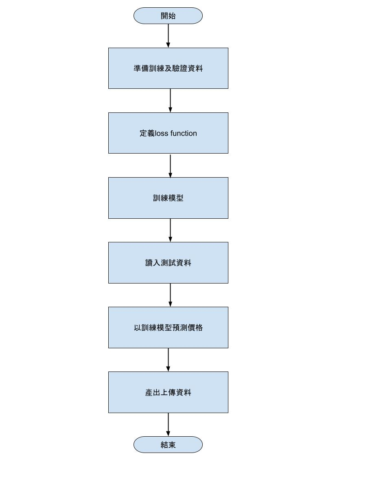

# 使用回歸模型做房價預測

## 做法說明

* 由於還對pytorch不熟，在網路上找到一個機器學習用的套件：scikit-learn。
* 在kaggle上找到幾個程式參考[程式1](https://www.kaggle.com/code/apapiu/regularized-linear-modelshttps:/)[程式2](https://www.kaggle.com/code/serigne/stacked-regressions-top-4-on-leaderboard)。
* 先寫出第一版:程式碼：main.ipynb。

## 程式方塊圖與寫法

## 畫圖做結果分析

## 討論預測值誤差很大的，是怎麼回事？

由於原本參考的程式是用rms，而本次要求是用MAE， 應該可以改用MAE

## 如何改進？

改版：chg_score.jpynb，但對api不熟，有錯。
